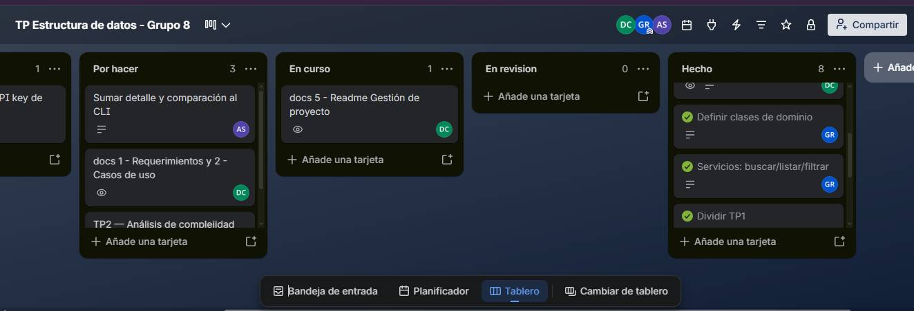

# Gestión del proyecto

## Tablero de Trello

[Enlace al tablero de Trello](https://trello.com/b/qq4uwa2a/tp-estructura-de-datos-grupo-8)

El equipo utilizó Trello durante el desarrollo del TP1 para organizar las tareas del proyecto y realizar un seguimiento de su avance.

El tablero se organizó mediante las siguientes columnas:

- **Por hacer:** tareas pendientes de realizar.
- **En curso:** tareas que se encontraban en desarrollo.
- **En revisión:** tareas terminadas pendientes de revisión.
- **Hecho:** tareas finalizadas y revisadas.

Las tareas fueron creadas y organizadas inicialmente por un integrante del equipo. A medida que se fueron completando, los integrantes actualizaron el estado de las tarjetas y las trasladaron a la columna correspondiente.

## Sprint 1 - TP1

El objetivo del sprint fue completar las tareas correspondientes al TP1 y organizar el trabajo del equipo mediante el tablero de Trello.

### Evidencia

Se incluyen capturas del tablero como evidencia de su utilización durante el desarrollo del TP1.
